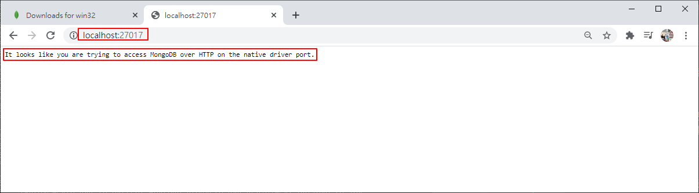
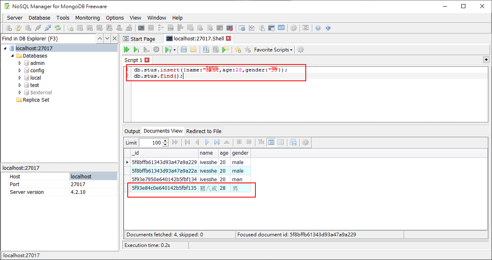

# MongoDB Study

# MongoDB下載並安裝

https://www.mongodb.org/dl/win32/

- 偶數版本為穩定版，奇數版本為開發版
- MongoDB對32位元版本支援性很差

捉了一個次新的版本

mongodb-win32-x86_64-2012plus-4.2.10-signed.msi


安裝


# 配置環境變數

C:\Program Files\MongoDB\Server\4.2\bin


測試


在c盤根目錄下，創建一個資料夾data，在data資料夾下創一個資料夾db (給mongoDB使用)


# 啟動MongoDB服務器

```bash
mongod
```


執行該指令，在db資料夾即會生成mongoDB的檔案


# 啟動MongoDB客戶端

再另開一個cmd視窗

```bash
mongo
```




```bash
# 修改預設path或port
# mongod --dbpath 數據庫路徑 --port 端口號
mongod --dbpath C:\Program Files\MongoDB\Server\4.2\bin --port 6379

```

# MongoDB 三個概念

## 數據庫 database

數據庫是一個倉庫，在倉庫可以存放集合

## 集合 collection

集合類似於數據，在集合中可以存放文檔

## 文檔 document

文檔是數據庫中最小單位，我們存儲和操作的內容都是文檔

# 基本指令

顯示當前所有的數據庫
```sql
show dbs
show databases
```

進入到指定的數據庫中
```sql
use 數據庫名
```

db表示的是當前所處的數據庫
```sql
db
```

顯示數據庫中所有的集合
```sql
show collections
```

# 數據庫的CRUD(增刪改查)的操作

> 向數據庫中插入文檔

向集合中插入文檔
```sql
-- db.<collection>.insert(doc)
db.stus.insert({name:"ivesshe",age:"20",gender:"male"});
```


查詢當前集合中的所有文檔
```sql
-- db.<collection>.find()
db.stus.find()
```

# 下載圖形化界面

> NoSQL Manager for MongoDB

https://www.mongodbmanager.com/download


# 安裝NoSQL Manager for MongoDB


# 操作

可執行shell命令行，按F6會執行該行

右下方紅框的地方，可以選擇輸出格式


## 按F9會執行所選取的部分


# 官網文檔

https://docs.mongodb.com/manual/tutorial/insert-documents/


# 向數據庫插入文檔insert

向集合中插入一個
```bash
# db.<collection>.insert()
db.stus.insert({name:"豬八戒",age:28,gender:"男"});
db.stus.find();
```

上方shell的中文輸入區好像怪怪的，無法輸入中文，顯示也不正常，但可以正常執行該指令



向集合中插入多個文檔
```bash
# db.<collection>.insert()
db.stus.insert({name:"豬八戒",age:28,gender:"男"});
db.stus.insert([
    {name:"沙和尚",age:38,gender:"男"},
    {name:"白骨精",age:16,gender:"女"},
    {name:"蜘蛛精",age:14,gender:"女"}
])
db.stus.insert({_id:"hello",name:"珠珠",age:16,gender:"女"});
db.stus.find();
```


若沒有給文檔指定_id屬性，則數據庫會自動為文檔添加_id，該屬性用來作為文檔的唯一標識，_id可以自己指定，但如果自己指定了數據庫就不會再添加了

```bash
ObjectId()
```

插入一個文檔對象
```bash
db.collection.insertOne()
```

插入多個文檔對象
```bash
db.collection.insertMany()
```

# 查詢find

查詢集合中所有的文檔
```bash
# db.collection.find()
db.stus.find();
db.stus.find({});
db.stus.find({_id:"hello"});
db.stus.find({name:"白骨精",age:16});
```

查詢集合中符合條件的第一個文檔
```bash
# db.collection.findOne()
db.stus.findOne({age:16});
db.stus.find({}).count();
```


# 更新update

- update()默認情況下會使用新對象來替換舊的對象
- 如果需要修改指定的屬性，而不是替換需要使用"修改操作符"來完成修改
    + $set 可以用來修改文檔中的指定屬性
    + $unset 可以用來刪除文檔的指定屬性
- update()默認只會修改一個

查詢集合中符合條件的第一個文檔
```bash
# db.collection.update(查詢條件，新對象)
db.stus.update({name:"沙和尚"},{age:28});

db.stus.update(
    {"_id":ObjectId("5f93eca20e640142b5fbf136")},
    {
        $set:{
            name:"沙和尚"
        }
    }
);

db.stus.update(
    {"_id":ObjectId("5f93eca20e640142b5fbf136")},
    {
        $set:{
            gender:"男",
            address:"流沙河",
        }
    }
);

db.stus.update(
    {"_id":ObjectId("5f93eca20e640142b5fbf136")},
    {
        $unset:{
            address:1,
        }
    }
);
```

同時修改多個符合條件的文檔
```bash
db.collection.updateMany();
```

修改一個符合條件的文檔
```bash
db.collection.updateOne();
```

```bash
# update()默認只會修改一個
db.stus.update(
    {"name":"豬八戒"},
    {
        $set:{
            address:"高老莊3",
        }
    }
);

# updateMany
db.stus.updateMany(
    {"name":"豬八戒"},
    {
        $set:{
            address:"豬老莊",
        }
    }
);

# update加屬性multi，可以修改多個
db.stus.updateMany(
    {"name":"豬八戒"},
    {
        $set:{
            address:"豬老莊2",
        }
    },
    {
        multi:true
    }
);
```

# 刪除 remove delete

可以根據條件要刪除文檔，傳遞條件的方式和find()一樣, 刪除符合條件的所有文檔(默認情況下會刪除多個)
```bash
db.collection.remove();
```

```bash
db.collection.deleteOne();

db.collection.deleteMany();
```

刪除集合
```bash
db.collection.drop();
```

刪除數據庫
```bash
db.dropDatabase();
```

刪除_id為"hello"的資料
```bash
db.stus.remove({_id:"hello"});
```

刪除符合條件的所有資料
```bash
db.stus.remove({age:28});
``` 

第二個參數傳true，會只刪符合條件的第一個資料
```bash
db.stus.remove({age:28},true);
```

清空集合(性能較差)
```bash
db.stus.remove({});
```

drop該集合(刪除集合)
```bash
db.stus.drop();
```


> 通常不會真的使用到刪除資料的指令，真實的操作會多增加一個是否刪除資料的字段，用來判斷是否顯示該資料，而不會真的刪除該筆資料

新增測試的資料，多了一個isDel的字段
```bash
db.stus.insert([
    {
        name:"zbj",
        isDel:0
    },
    {
        name:"sbs",
        isDel:0
    },
    {
        name:"ts",
        isDel:0
    },
]);
```

將ts刪除(僅改變isDel)
```bash
db.stus.updateOne({name:"ts"},{$set:{isDel:1}});
```


查詢時將isDel條件加入
```bash
db.stus.find({isDel:0});
```


# 練習1

```bash
# 1.進入my_test數據庫
use my_test;

# 2.向數據庫的user集合插入一個文檔
db.users.insert({
    username:"sunwukong"
});

# 3.查詢user集合中的文檔
db.users.find();

# 4.向數據庫的user集合中插入一個文檔
db.users.insert({
    username:"zhubajie"
});

# 5.查詢數據庫user集合中的文檔
db.users.find();

# 6.統計數據庫user集合中的文檔數量
db.users.find().count();

# 7.查詢數據庫user集合中username為sunwukong的文檔
db.users.find({username:"sunwukong"});

# 8.向數據庫user集合中的username為sunwukong的文檔，添加一個address屬性，屬性值為huagoushan
db.users.update({username:"sunwukong"},{$set:{address:"huaguoshan"}});

# 9.使用{username:"tangseng"}替換username為zhubajie的文檔
db.users.replaceOne({username:"zhubajie"},{username:"tangseng"});

# 10.刪除username為sunwukong的文檔的address屬性
db.users.update({username:"sunwukong"},{$unset:{address:1}});

# 11.向username為sunwukong的文檔中，添加一個hobby:{cities:["beijing","shanghai","shenzhen"],movies:["sanguo","hero"]}
# MongoDB文檔的屬性值也可以是一個文檔，當一個文檔的屬性值是一個文檔時，我們稱這個文檔叫作內嵌文檔
db.users.update({username:"sunwukong"},{$set:{hobby:{cities:["beijing","shanghai","shenzhen"],movies:["sanguo","hero"]}}});

# 12.向username為tangseng的文檔中，添加一個hobby:{movies:["A Chinese Odyssey","King of comedy"]}
db.users.update({username:"tangseng"},{$set:{hobby:{movies:["A Chinese Odyssey","King of comedy"]}}});

# 13.查詢喜歡電影hero的文檔
# MongoDB支持直接通過內嵌文檔的屬性進行查詢，如果要查詢內嵌文檔則可以通過.的型式來匹配
# 如果要通過內嵌文檔來對文檔進行查詢，此時屬性名必須使用引號
db.users.find({"hobby.movies":"hero"});

# 14.向tangseng中添加一個新的電影Interstellar
# $push用於向數組中添加一個新的元素
# $addToSet向數組中添加一個新元素(如果數組中已經存在該元素，則不會添加)
db.users.update({username:"tangseng"},{$push:{"hobby.movies":"Interstellar"}});

# 15.刪除喜歡beijing的用戶
db.users.remove({"hobby.cities":"beijing"});

# 16.刪除user集合
db.users.remove({});
db.users.drop();

show dbs;

# 17.向numbers中插入20000條數據

# 耗時8.5秒
for(var i=1; i<=20000; i++){
    db.numbers.insert({num:i});
};

db.numbers.find();
db.numbers.remove({});

# 另一種寫法
# 耗時0.5秒
var arr = [];
for(var i=1; i<=20000; i++){
    arr.push({num:i});
}
db.numbers.insert(arr);
```

# 練習2

```bash


```
